# 0x7444ff

Welcome to the 0x7444ff Shader Collection – a compilation of GLSL shaders written by [@SahilK-027](https://github.com/SahilK-027)!

> [!IMPORTANT]  
> **Before You Begin 👀**
>
> Performance Warning
> Some shaders in this collection are computationally intensive. They are designed to push GPU limits and may cause performance drops on low-end or mobile devices. It’s recommended that they be tested on devices with modern graphics hardware.
>
> Compatibility Considerations:
> These shaders are tested on WebGL2-compatible browsers such as Chrome, Firefox, and Edge. However, variations may occur depending on the hardware and browser versions. For the best experience, use the latest browser version and update your graphics drivers.
>
> Learning Resources and Support:
> If you’re new to shader programming, explore [The Book of Shaders](https://thebookofshaders.com/) for guidance. For questions about this collection, start a discussion on the repository or reach out via GitHub.

## Overview

This repository is a creative collection of GLSL shaders crafted purely for the joy of digital art development. Enjoy the junction where technology meets Art!

> [!TIP]
>
> 

> 
&nbsp; Why choose shader programming over built-in options?

>
> Shader programming provides improved performance and endless customization by running directly on the GPU, allowing developers to create unique visual effects and optimize rendering for specific needs. While built-in options offer faster implementation and easier maintenance, custom shaders unlock advanced capabilities like complex lighting, post-processing effects, and physics-based rendering that aren't possible with pre-made solutions.
>
> 

## Collection Table

<table>
<tr>
<th>#</th>
<th>Project Preview</th>
<th>Link</th>
<th>#</th>
<th>Project Preview</th>
<th>Link</th>
</tr>
<tr>
<td>(1)</td>
<td></td>
<td><a href="https://kaleidoscope-sk027.vercel.app/">Kaleidoscope</a> </td>

<td>(2)</td>
<td>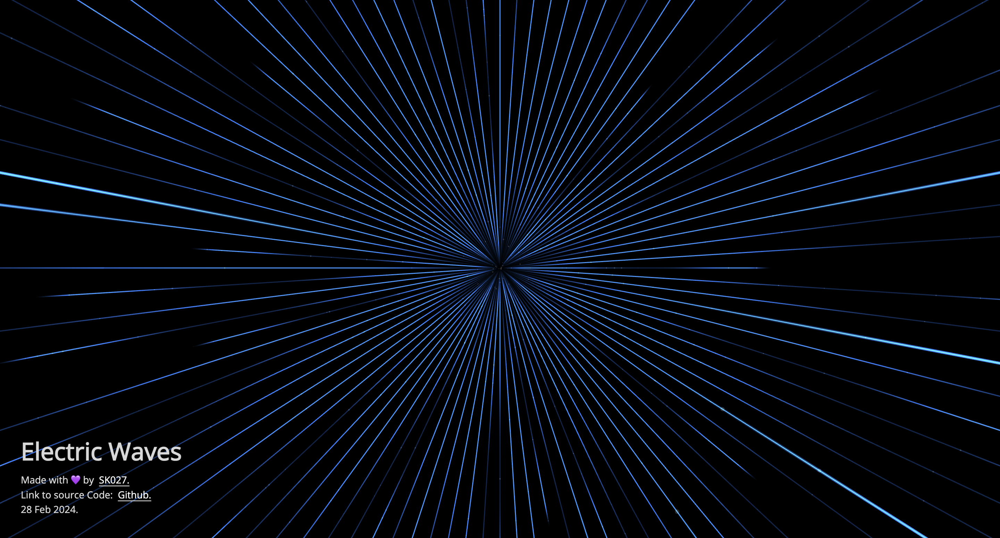</td>
<td><a href="https://electric-waves-sk027.vercel.app/">Electric Waves</a> </td>
</tr>

<tr>
<td>(3)</td>
<td>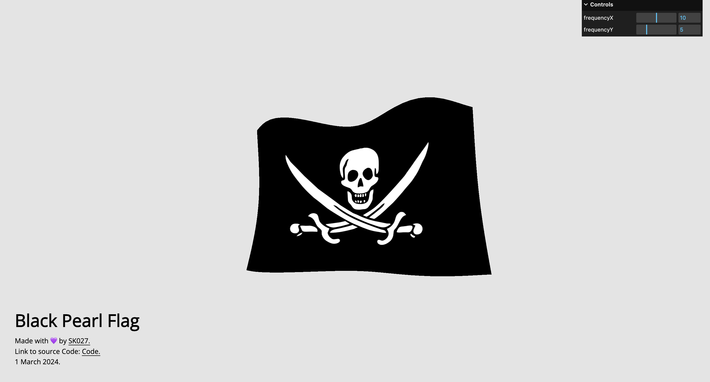</td>
<td><a href="https://black-pearl-flag-sk027.vercel.app/">Black Pearl Flag</a> </td>

<td>(4)</td>
<td>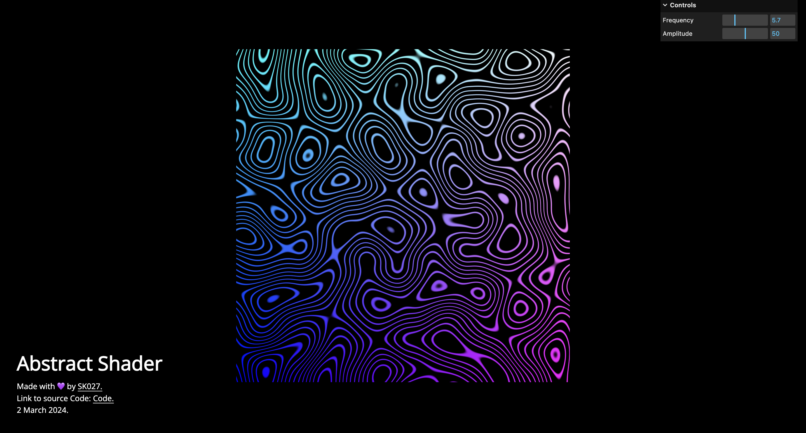</td>
<td><a href="https://abstract-pattern-sk027.vercel.app/">Abstract Pattern</a> </td>
</tr>

<tr>
<td>(5)</td>
<td>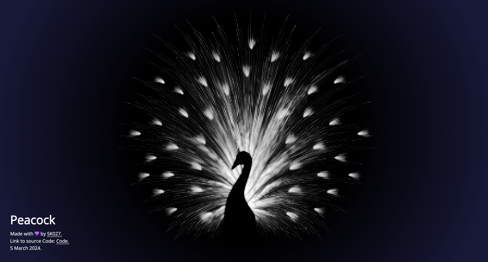</td>
<td><a href="https://peacock-sk027.vercel.app/">Peacock Animation</a> </td>

<td>(6)</td>
<td>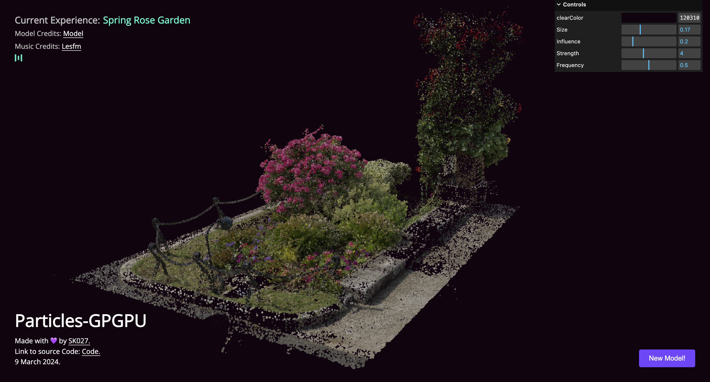</td>
<td><a href="https://particles-gpgpu-sk027.vercel.app/">Particles-GPGPU</a> </td>
</tr>

<tr>
<td>(7)</td>
<td>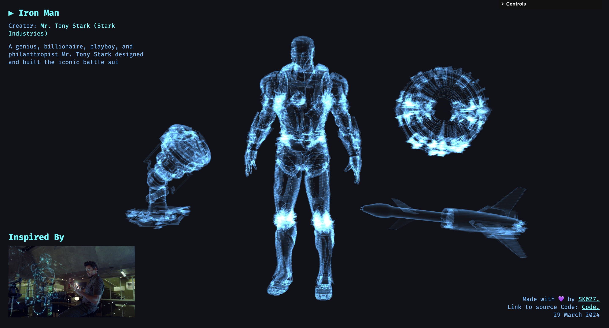</td>
<td><a href="https://iron-man-sk027.vercel.app/">Iron-man</a> </td>

<td>(8)</td>
<td>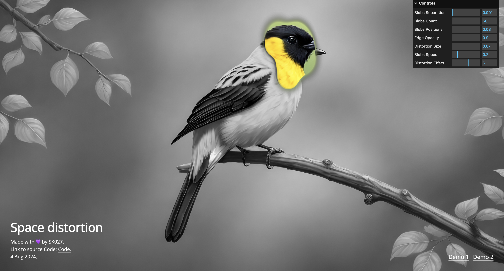</td>
<td><a href="https://space-distortion-sk027.vercel.app/">Space Distortion</a> </td>
</tr>

<tr>
<td>(9)</td>
<td></td>
<td><a href="https://poly-ele-sk027.vercel.app/">Poly-ele</a> </td>

<td>(10)</td>
<td>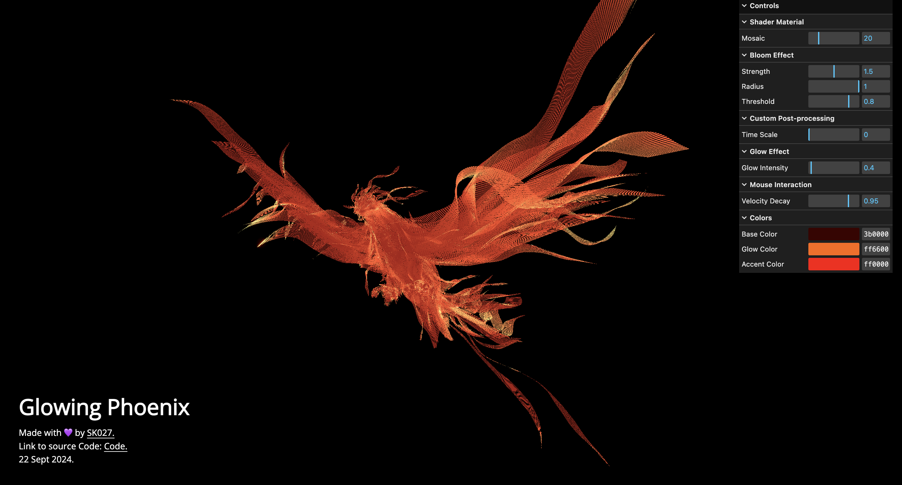</td>
<td><a href="https://glowing-phoenix-sk027.vercel.app/">Glowing Phoenix</a> </td>
</tr>

<tr>
<td>(11)</td>
<td>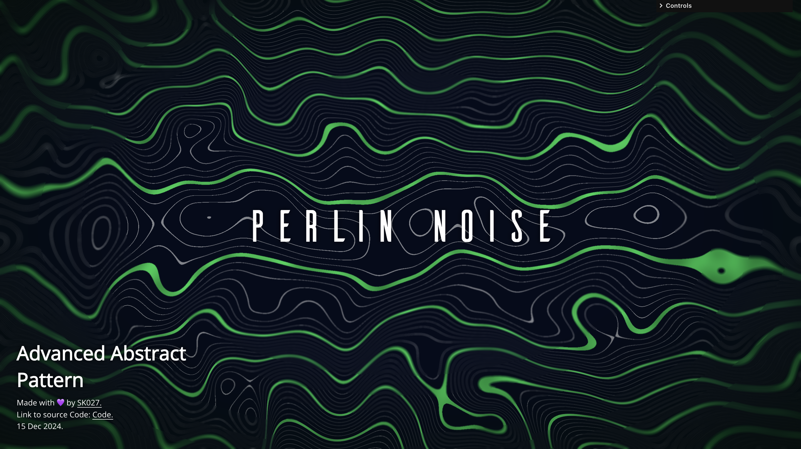</td>
<td><a href="https://0x7444ff-perlin-noise-advanced-abstract-pattern.vercel.app/">Advanced Abstract Pattern</a> </td>

<td>(12)</td>
<td></td>
<td><a href="https://0x7444ff-transformers-transition.vercel.app/">Transformers Transition</a> </td>
</tr>

<tr>
<td>(13)</td>
<td>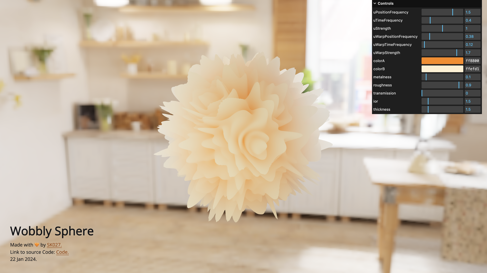Wobbly Sphere preview"></td>
<td><a href="https://0x7444ff-wobbly-sphere.vercel.app/">Wobbly Sphere</a> </td>

<td>(14)</td>
<td>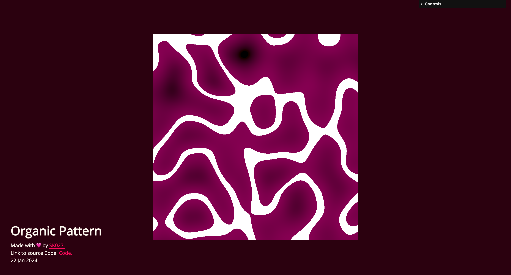</td>
<td><a href="https://0x7444ff-organic-pattern.vercel.app/">Organic Pattern</a> </td>
</tr>

<tr>
<td>(15)</td>
<td>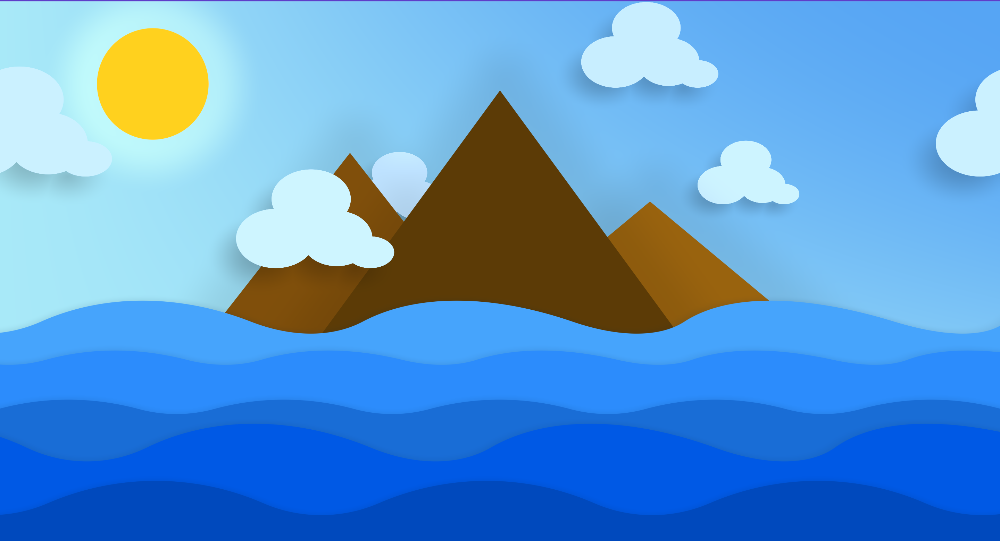</td>
<td><a href="https://0x7444ff-2d-day-night.vercel.app/">2D Day Night</a> </td>

<td>(16)</td>
<td></td>
<td><a href="https://0x7444ff-sk027-scrolling-textures.vercel.app/">Scrolling textures</a> </td>
</tr>

<tr>
<td>(17)</td>
<td></td>
<td><a href="https://0x7444ff-grass-sk027.vercel.app/">Grass</a> </td>

</tr>

</table>
