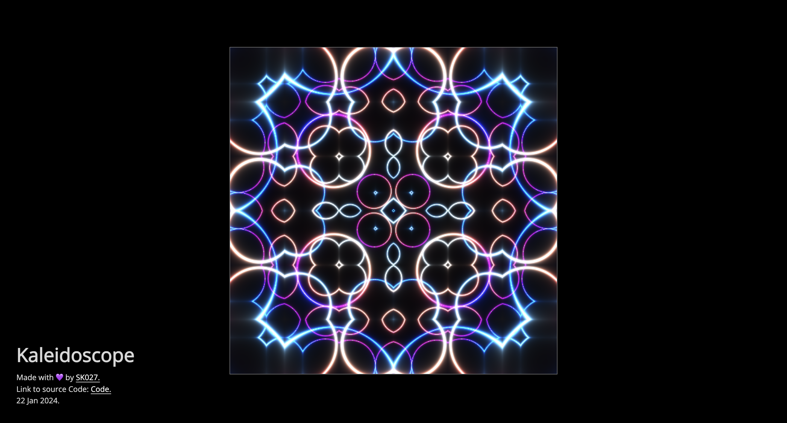

# 0x7444ff

Welcome to the 0x7444ff Shader Collection – a curated compilation of GLSL shaders and WebGL experiments by [@SahilK-027](https://github.com/SahilK-027). This repository showcases the intersection of mathematics, graphics programming, and digital art through 18+ interactive shader projects.

## Overview

This repository is a creative collection of GLSL shaders crafted for the joy of digital art and graphics programming. Each project demonstrates different shader techniques, from procedural patterns and noise functions to GPGPU particle systems and advanced rendering effects. Whether you're learning shader programming or seeking inspiration, explore where technology meets art.

> [!IMPORTANT]  
> **Before You Begin 👀**
>
> **Performance Warning**  
> Some shaders in this collection are computationally intensive and designed to push GPU limits. They may cause performance drops on low-end or mobile devices. Testing on devices with modern graphics hardware is recommended.
>
> **Compatibility Considerations**  
> These shaders are tested on WebGL2-compatible browsers (Chrome, Firefox, Edge). Variations may occur depending on hardware and browser versions. For the best experience, use the latest browser version and keep your graphics drivers updated.
>
> **Learning Resources**  
> New to shader programming? Start with [The Book of Shaders](https://thebookofshaders.com/) for comprehensive guidance. For questions about this collection, open a discussion on the repository or reach out via GitHub.

## Collection Table

<table>
<tr>
<th>#</th>
<th>Project Preview</th>
<th>Link</th>
<th>#</th>
<th>Project Preview</th>
<th>Link</th>
</tr>
<tr>
<td>(1)</td>
<td></td>
<td><a href="https://kaleidoscope-sk027.vercel.app/">Kaleidoscope</a><br/></td>

<td>(2)</td>
<td></td>
<td><a href="https://electric-waves-sk027.vercel.app/">Electric Waves</a><br/></td>
</tr>

<tr>
<td>(3)</td>
<td></td>
<td><a href="https://black-pearl-flag-sk027.vercel.app/">Black Pearl Flag</a><br/></td>

<td>(4)</td>
<td></td>
<td><a href="https://abstract-pattern-sk027.vercel.app/">Abstract Pattern</a><br/></td>
</tr>

<tr>
<td>(5)</td>
<td></td>
<td><a href="https://peacock-sk027.vercel.app/">Peacock Animation</a><br/></td>

<td>(6)</td>
<td></td>
<td><a href="https://particles-gpgpu-sk027.vercel.app/">Particles-GPGPU</a><br/></td>
</tr>

<tr>
<td>(7)</td>
<td></td>
<td><a href="https://iron-man-sk027.vercel.app/">Iron-man</a><br/></td>

<td>(8)</td>
<td></td>
<td><a href="https://space-distortion-sk027.vercel.app/">Space Distortion</a><br/></td>
</tr>

<tr>
<td>(9)</td>
<td></td>
<td><a href="https://poly-ele-sk027.vercel.app/">Poly-ele</a><br/></td>

<td>(10)</td>
<td></td>
<td><a href="https://glowing-phoenix-sk027.vercel.app/">Glowing Phoenix</a><br/></td>
</tr>

<tr>
<td>(11)</td>
<td></td>
<td><a href="https://0x7444ff-perlin-noise-advanced-abstract-pattern.vercel.app/">Advanced Abstract Pattern</a><br/></td>

<td>(12)</td>
<td></td>
<td><a href="https://0x7444ff-transformers-transition.vercel.app/">Transformers Transition</a><br/></td>
</tr>

<tr>
<td>(13)</td>
<td>Wobbly Sphere preview"></td>
<td><a href="https://0x7444ff-wobbly-sphere.vercel.app/">Wobbly Sphere</a><br/></td>

<td>(14)</td>
<td></td>
<td><a href="https://0x7444ff-organic-pattern.vercel.app/">Organic Pattern</a><br/></td>
</tr>

<tr>
<td>(15)</td>
<td></td>
<td><a href="https://0x7444ff-2d-day-night.vercel.app/">2D Day Night</a><br/></td>

<td>(16)</td>
<td></td>
<td><a href="https://0x7444ff-sk027-scrolling-textures.vercel.app/">Scrolling textures</a><br/></td>
</tr>

<tr>
<td>(17)</td>
<td></td>
<td><a href="https://0x7444ff-grass-sk027.vercel.app/">Grass</a><br/></td>

<td>(18)</td>
<td></td>
<td><a href="https://0x7444ff-voronoi-electric-pattern.vercel.app/">Voronoi electric pattern</a><br/></td>
</tr>

<tr>
<td>(19)</td>
<td></td>
<td><a href="https://0x7444ff-spectral-flow.vercel.app/">Spectral Flow</a><br/></td>
</tr>
</table>

## Getting Started

### Prerequisites

- Node.js (v16 or higher)
- npm or yarn
- A modern browser with WebGL2 support

### Running a Project Locally

Each project is self-contained with its own dependencies. To run any project:

```bash
# Navigate to the project directory
cd [project-name]

# Install dependencies
npm install

# Start the development server
npm run dev
```

The project will open in your browser at `http://localhost:5173` (or similar).

## Tech stack

- **Three.js** – 3D graphics library
- **WebGL2** – Graphics API
- **GLSL** – OpenGL Shading Language
- **Vite** – Build tool and dev server
- **JavaScript/ES6+** – Core programming language

## Learning Resources

- [The Book of Shaders](https://thebookofshaders.com/) – Interactive guide to GLSL
- [Three.js Documentation](https://threejs.org/docs/) – Official Three.js docs
- [Shadertoy](https://www.shadertoy.com/) – Community shader examples
- [WebGL Fundamentals](https://webglfundamentals.org/) – WebGL tutorials
- [Inigo Quilez Articles](https://iquilezles.org/articles/) – Advanced shader techniques

## License

This project is licensed under the MIT License - see the [LICENSE](LICENSE) file for details.

## Connect

Created by [@SahilK-027](https://github.com/SahilK-027)

---

> Made with 💜 and GLSL
