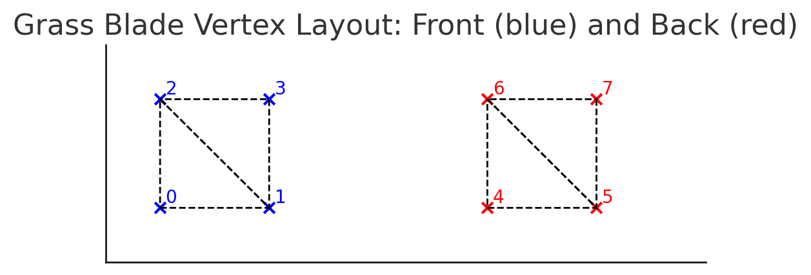

Here’s a visual breakdown:

- Blue points (0–3): the front‑face vertices (indices 0,1 form the lower row; 2,3 the upper).

- Red points (4–7): the back‑face vertices (shifted by VERTICES = 4, so index 4 corresponds to front‑0, etc.).

- Dashed quads: each row pair (0→2 and 1→3) form the two triangles on the front (winding CCW) and on the back (winding CW).

- Diagonal lines: illustrate the shared edge for each quad’s two triangles:

  - Front lower tri: (0,1,2)

  - Front upper tri: (2,1,3)

  - Back lower tri: (6,5,4)

  - Back upper tri: (7,5,6)

With fi = VERTICES + vi, the back strip (red) lines up exactly under the correct front vertices, so every segment renders two full triangles on each side.
